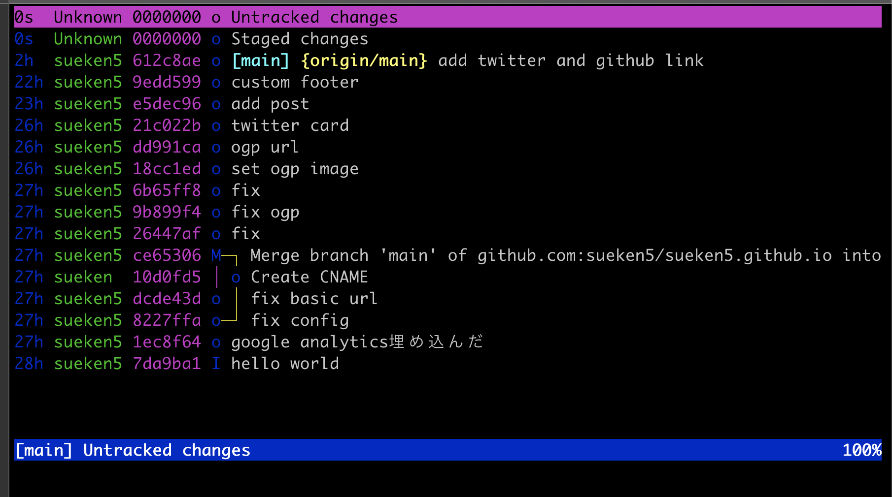
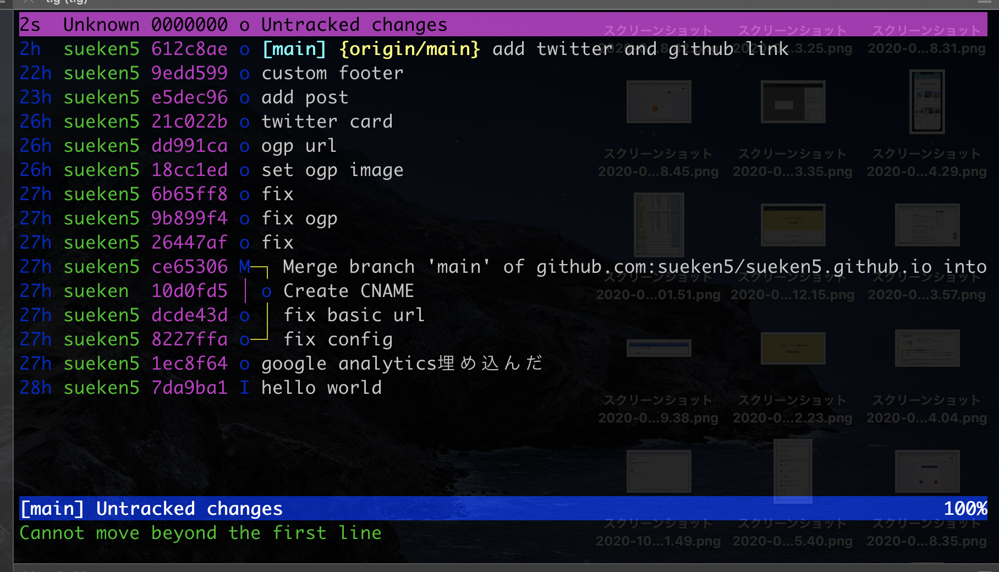
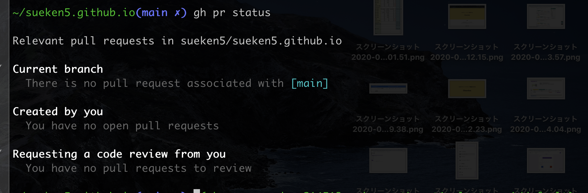

## やりたいこと

github.comにアクセスしないでローカルからPullRequestを作成できるようにします。

## tl;dr

`~/.gitconfig`に追記

```
[push]
default = current
```

`~/.tigrc`に追記

```
bind status R >gh pr create
bind status V >gh pr view
```

tig status viewで`shift + r`でPullRequest作成

## tig

tigの詳しい説明は次の記事を参考にしてください。

[tigでgitをもっと便利に！ addやcommitも](https://qiita.com/suino/items/b0dae7e00bd7165f79ea)

簡単に説明するとgitをよりビジュアル面や操作面で強化したツールになります。



## gh

[公式ページ](https://github.com/cli/cli)

ghはgithubがossで公開しているcliツールです。ターミナルからgithubにPullRequestを送ったりすることができます。

詳しい説明は次の記事を参考にしていください。

[GitHubを操作するCLI「gh – The GitHub CLI tool」(Beta)を試す](https://dev.classmethod.jp/articles/shuntaka9576-gh/)



## PullRequestを送れるようにする。

実際にPullRequestを送れるように設定していきます。

まず`~/.gitconfig`を修正します。次を追記します。

```
[push]
default = current
```

これを追記すると`git push origin {作業ブランチ名}`と入力してgithubにpushしていたところを
`git push`のみで現在の作業ブランチをpushすることができます。

具体的にいうと次のようになります。

```
git checkout -b feature
git add .
git commit
git push //featureブランチが指定される
```

次にtigを設定します。`~/.tigrc`に次のものを追記します。

```
bind status R >gh pr create
bind status V >gh pr view
```

この意味としてはstatus view(main viewで`shit+s`して遷移する画面)では`shift + r`を
入力すると`gh pr create`しますよ。という設定です。

## 動作


## まとめ

ブラウザまで行かずにpr作れるので効率的で良い感じです。